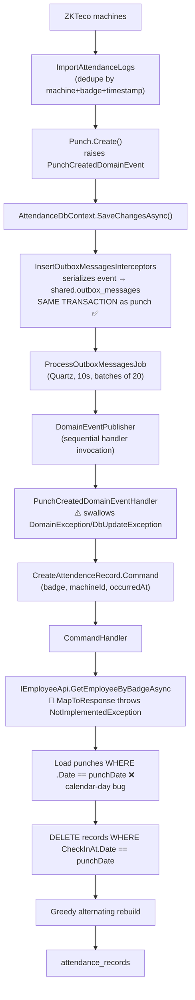
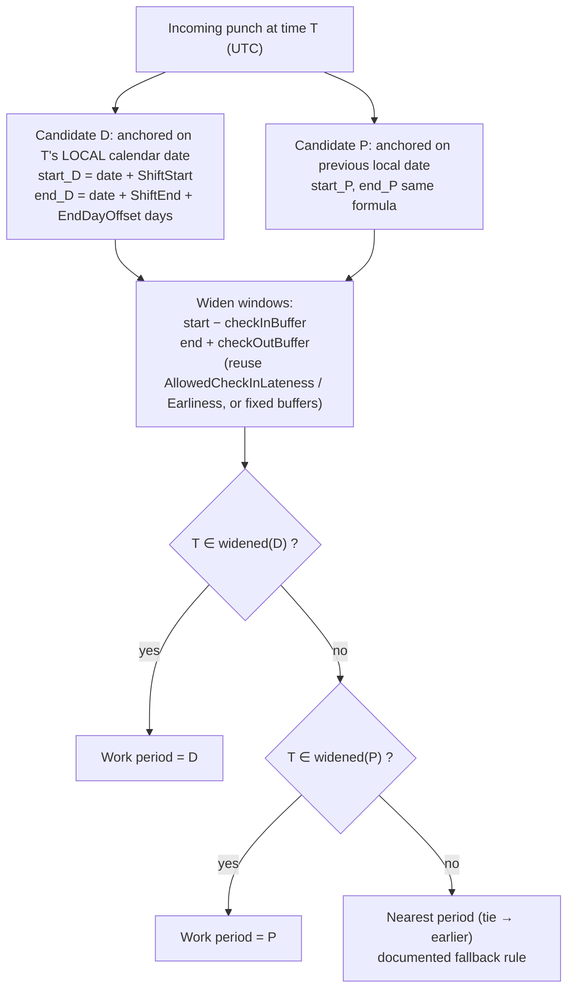
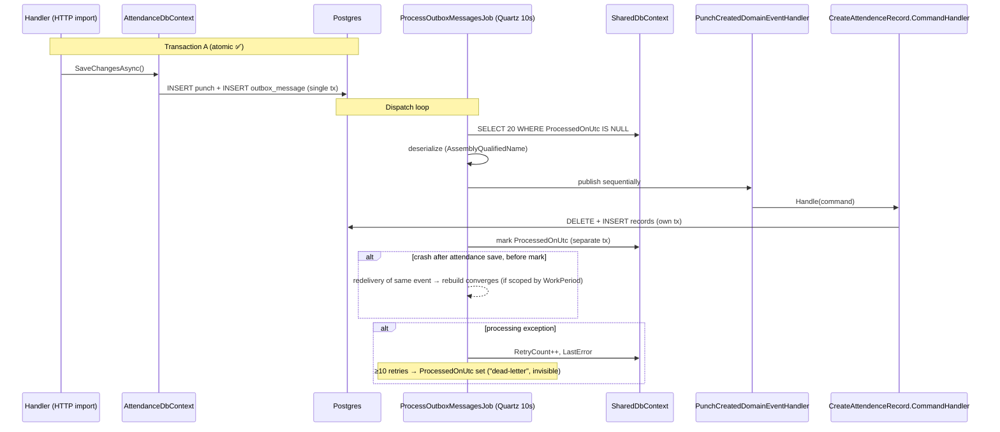
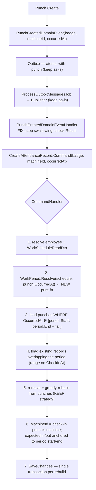

# Attendance Architecture Review — Prototype

> Scope: Punch → Outbox → AttendanceRecord processing flow.
> Verdict up front: **the skeleton is sound; keep it. Fix the calendar-day scoping (overnight shifts), fix the swallowed failures, and implement the dead `EmployeeApi` mapping.**
> Status: design only — no code changes made.

---

## Table of Contents

1. [Current Architecture](#1-current-architecture)
2. [Actual Punch → Attendance Flow](#2-actual-punch--attendance-flow)
3. [Bugs Found](#3-bugs-found)
4. [Overnight Shift Analysis (step-by-step)](#4-overnight-shift-analysis)
5. [Work Period Concept](#5-work-period-concept)
6. [Outbox Analysis](#6-outbox-analysis)
7. [Recommended Architecture](#7-recommended-architecture)
8. [Responsibility Breakdown](#8-responsibility-breakdown)
9. [Idempotency & Concurrency](#9-idempotency--concurrency)
10. [Prototype Scope: MUST FIX / SHOULD FIX / FUTURE](#10-prototype-scope)
11. [Implementation Plan](#11-implementation-plan)

---

## 1. Current Architecture

What actually exists in the repo:

### 1.1 Ingestion — `ImportAttendanceLogs.cs`

- POST endpoint reads raw logs from all **active ZKTeco machines**.
- Dedupes against existing punches by `(MachineId, EmployeeBadge, PunchOccurredAt)` — both against the DB and within the batch.
- Calls `Punch.Create(...)` which raises `PunchCreatedDomainEvent(MachineId, EmployeeBadge, PunchOccurredAt)`.
- Saves via `AttendanceDbContext`.

### 1.2 Outbox capture — `InsertOutboxMessagesInterceptors.cs`

- A `SaveChangesInterceptor` registered on **every** DbContext (`AttendanceDbContext`, `EmployeeDbContext`, `SharedDbContext`, `ApplicationDbContext`).
- Drains `Entity.DomainEvents`, serializes with Newtonsoft.Json (`TypeNameHandling.All`, `Name = AssemblyQualifiedName`), adds `OutboxMessage` rows in the **same `SaveChanges()` batch**.
- Every module DbContext maps `shared.outbox_messages` with `excludeFromMigrations: true`; migrations are owned by `SharedDbContext`.
- ➡️ **Punch + outbox row commit atomically** in one implicit transaction.

### 1.3 Outbox dispatch — `ProcessOutboxMessagesJob.cs`

| Aspect | Implementation |
|---|---|
| Scheduler | Quartz, every 10s, `[DisallowConcurrentExecution]` |
| Batch | 20 unprocessed messages, ordered by `Guid Id` (**meaningless ordering**) |
| Publish | `DomainEventPublisher` — resolves handlers from root provider, invokes sequentially via `dynamic` |
| Success | `ProcessedOnUtc = UtcNow` |
| Failure | `RetryCount++`, `LastError`, `LastAttemptOnUtc` |
| Dead-letter | After 10 retries → sets `ProcessedOnUtc` (indistinguishable from success — no status column) |

### 1.4 Handler chain

```text
PunchCreatedDomainEventHandler
    → builds CreateAttendenceRecord.Command(EmployeeBadge, MachineId, PunchOccurredAt)
    → calls ICommandHandler<CreateAttendenceRecord.Command> directly (DI-resolved)
    → catches DomainException / DbUpdateException and LOGS-AND-SWARMS them ❌
```

### 1.5 Command handler — `CreateAttendenceRecord.CommandHandler`

1. Badge → `IEmployeeApi.GetEmployeeByBadgeAsync(badge)`.
2. Load punches where `PunchOccurredAt.Date == command.PunchOccurredAt.Date`.
3. Load attendance records where `CheckInAt.Date == command.PunchOccurredAt.Date`.
4. `RemoveRange(existingRecords)`.
5. Greedy alternating rebuild over ordered punches:
   - No open record → `AttendanceRecord.Create(...)` + `RegisterCheckIn(punch, expectedCheckIn, prev)`.
   - Open record → build `WorkSchedule(WorkTime, expectedCheckOutDateTime)` + `RegisterCheckOut(punch, schedule)`.
   - `DomainException` inside loop → `continue` (punch silently dropped).
6. `AddRange(newRecords)` + single `SaveChanges()`.

Expected check-in anchor: `punch.PunchOccurredAt.Date + ShiftStartTime + AllowedCheckInLatenessMinutes`
Expected check-out anchor: `lastRecord.CheckInAt.Date + ShiftEndTime − AllowedCheckOutEarlinessMinutes + EndDayOffset days`

### 1.6 Domain model highlights

**`AttendanceRecord`** (`Domain/AttendenceRecords/AttendenceRecord.cs`)
- Fields: `MachineId`, `EmployeeId` (cross-module string ref), `CheckInAt`, `CheckOutAt?`, `WorkedTime`, `Overtime`, `LateTime`, `EarlyLeaveTime`, `IsAbsent`.
- `MinMinutesBetweenCheckInAndCheckOut = 3`.
- `RegisterCheckIn(checkInAt, expectedCheckInTime, prevRecord)` — rejects check-in within 3 min of previous record's checkout.
- `RegisterCheckOut(checkOutAt, workSchedule)` — rejects `CheckIn >= CheckOut` and duration < 3 min; computes worked time, overtime (vs `StandardWorkTime`), early leave (vs `ExpectedCheckOutTime`).
- `CalculateLateTime`: `max(0, actualCheckIn − expectedCheckIn)` ✅ direction correct.
- `CalculateEarlyLeave`: `max(0, expectedCheckOut − actualCheckOut)` ✅ direction correct.

**`Employees ... WorkSchedule`** (`Domain/EmployeeGroups/WorkSchedules/WorkSchedule.cs`)
- Per `EmployeeGroup` (not per employee).
- `ShiftStartTime: TimeOnly`, `ShiftEndTime: TimeOnly`, `EndDayOffset: int`, `BreakStartTime/BreakEndTime: TimeOnly`, `AllowedCheckInLatenessMinutes`, `AllowedCheckOutEarlinessMinutes`, `IsActive`.
- Overnight validation exists: `shiftStart >= shiftEnd && endDayOffset == 0` → `InvalidShiftRange`. ✅
- ⚠️ `WorkTime => CalculateWorkTime()` uses `DateTime.UtcNow` internally (impure), but the overnight *duration* math is coincidentally correct.

**Contract DTO** — `WorkScheduleReadDto(Id, EmployeeGroupId, ShiftStartTime, ShiftEndTime, WorkTime, EndDayOffset, BreakStartTime, BreakEndTime, AllowedCheckInLatenessMinutes, AllowedCheckOutEarlinessMinutes, IsActive)`.

### 1.7 🚨 Critical finding

`EmployeeApi.MapToResponse` is **commented out and throws `NotImplementedException`**
(`src/Modules/Employees/Employees/Application/EmployeeApi.cs:95`). `GetEmployeeWorkSchedule` also throws.
**The entire flow is currently dead at runtime**: every outbox message fails with an unhandled
`NotImplementedException` (not caught by the handler's catches) and lands in pseudo-dead-letter after 10 retries.

---

## 2. Actual Punch → Attendance Flow



The flow matches the intended sketch, with three corrections marked above:
❌ calendar-day scoping, ⚠️ swallowed failures, 🚨 dead employee mapping.

---

## 3. Bugs Found

| # | Severity | Bug | Why wrong | Recommended fix |
|---|----------|-----|-----------|-----------------|
| B1 | 🔴 **Critical** | `EmployeeApi.MapToResponse` throws `NotImplementedException`; `GetEmployeeWorkSchedule` also throws | Whole pipeline non-functional at runtime | Implement badge → schedule mapping (Enap `EmployeeGroup` → `WorkScheduleReadDto`, or wire to `EmployeeDbContext` schedules) |
| B2 | 🔴 **Critical** | Calendar-date windows: `PunchOccurredAt.Date == punchDate` for punches AND `CheckInAt.Date == punchDate` for records | Overnight shifts split across two "days" → corrupted/duplicated records (see §4) | Resolve a **work period** from the schedule; query with range predicates `[period.Start, period.End)` |
| B3 | 🟠 **High** | Event handler swallows `DomainException`/`DbUpdateException` and ignores `Result.Failure` from the command | Outbox message gets marked processed → attendance data **permanently lost**, no retry, no dead-letter | Let exceptions propagate so outbox retries/dead-letters; deliberately handle only known business skips (e.g., unknown badge) |
| B4 | 🟠 **High** | Expected check-in anchored to **punch date** (`punch.PunchOccurredAt.Date.Add(...)`) and expected checkout anchored to `lastRecord.CheckInAt.Date` | Wrong day for post-midnight punches; fragile for overnight shifts | Anchor both to the resolved **work period start/end** |
| B5 | 🟡 Medium | Record's `MachineId` taken from `command.MachineId` (triggering punch's machine) | Rebuild triggered by a different punch silently changes the stored machine | Store the **check-in punch's** `MachineId` |
| B6 | 🟡 Medium | `catch (DomainException) { continue; }` inside rebuild loop | Punches discarded with zero trace (e.g. checkout < 3 min after check-in) | At minimum log; document that near-duplicate punches are intentionally dropped |
| B7 | 🟡 Medium | Zone mixing: punches stored UTC (`AttendanceTime.DeviceLocalToUtc`, Africa/Algiers UTC+1), but `TimeOnly` shift fields added directly onto UTC datetimes; `.Date` filters cut at UTC midnight not local midnight | Shift boundaries off by 1h vs what employees/machines experience | Pick one convention explicitly (recommendation in §10/FUTURE) |
| B8 | 🟢 Low | Outbox `OrderBy(e => e.Id)` orders by random GUID | Processing order ≠ event order | Harmless *given* rebuild convergence; leave it, note it |
| B9 | 🟢 Low | Dead-letter sets `ProcessedOnUtc` — indistinguishable from success | Can't monitor poisoned messages | Add `Status` column later |
| B10 | 🟢 Low | `WorkSchedule.CalculateWorkTime()` reads `DateTime.UtcNow` | Impure domain property | Compute purely from `ShiftStart/ShiftEnd/EndDayOffset` |

---

## 4. Overnight Shift Analysis

Schedule: `ShiftStart=18:00, ShiftEnd=06:00, EndDayOffset=1`.
Punches: `Aug23 17:55`, `Aug23 18:03`, `Aug24 05:55`, `Aug24 06:02`.

### Event 1 — punch Aug23 17:55

| Step | What the code does |
|---|---|
| Punches loaded | `Date == Aug23` → `{17:55, 18:03}` |
| Records loaded | `CheckInAt.Date == Aug23` → none |
| Deleted | nothing |
| 17:55 | No open record → create R1. Expected check-in = Aug23 18:00+grace = **Aug23 18:10** → `LateTime = max(0, 17:55−18:10) = 0` |
| 18:03 | R1 open → checkout. Expected checkout = `R1.CheckInAt.Date(Aug23) + 05:45(end−grace) + 1 day` = **Aug24 05:45**. Passes guards → `CheckOut=Aug23 18:03`, `WorkedTime=8min`, `EarlyLeave≈11h42m` |
| Saved | **R1 = garbage 8-minute "shift"** |

### Event 2 — punch Aug23 18:03

Same window → deletes R1 → rebuilds identical garbage R1′ (new GUID). Converges in *content*, not identity.

### Event 3 — punch Aug24 05:55 (where it breaks 💥)

| Step | What the code does |
|---|---|
| Punches loaded | `Date == Aug24` → `{05:55, 06:02}` only — **the real check-in punches (17:55/18:03) are invisible** |
| Records loaded | `CheckInAt.Date == Aug24` → **none** (R1′ checks in Aug23) → **nothing deleted** |
| 05:55 | Creates R2, expected check-in = Aug24 18:10 (wrong day) → check-in 05:55 |
| 06:02 | Checkout on R2: expected checkout = `Aug24 + 05:45 + 1d` = Aug25 05:45 → `WorkedTime=7min`, `EarlyLeave≈23h43m` |

### Final state

```text
R1′: in Aug23 17:55 → out Aug23 18:03   (bogus, 8 min)
R2 : in Aug24 05:55 → out Aug24 06:02   (bogus, 7 min)
```

**Correct result should be ONE record:**

```text
in Aug23 18:03 (or 17:55) → out Aug24 05:55/06:02, worked ≈ 12h
```

---

## 5. Work Period Concept

**Yes — the domain needs this concept, but as a computed value object, NOT an entity/table.** KISS.

Recommended name: **`WorkPeriod`** — matches existing language (`WorkSchedule`, `AttendanceRecord`) without inventing jargon like `ScheduleOccurrence`.

```text
WorkPeriod(Guid employeeGroupId, DateTime StartUtc, DateTime EndUtc)
```

Plus one pure resolver function (no DB, fully unit-testable):

```text
WorkPeriodResolver.Resolve(WorkScheduleReadDto schedule, DateTime punchTimeUtc) → WorkPeriod
```

### Resolution algorithm (boundary-precise)



### Boundary examples (18:00 → 06:00 +1, zero buffers for clarity)

| Punch | Candidate D (same date) | Candidate P (prev date) | Result |
|---|---|---|---|
| `Aug24 05:30` | `Aug24 18:00 – Aug25 06:00` ✗ | `Aug23 18:00 – Aug24 06:00` ✓ | **Previous night's period** ✅ |
| `Aug24 07:00` | ✗ | ✗ (ends 06:00; even +60min buffer misses 07:00) | Outside any window → **nearest = P** (1h past end vs 11h before next start) → very-late checkout of prior shift. Must be an explicit documented rule. |

Key invariant: **a work period is not a calendar day.** `Aug23 18:00 → Aug24 06:00` is ONE period and ONE `AttendanceRecord`.

---

## 6. Outbox Analysis



| Question | Answer from code |
|---|---|
| Atomic with punch insert? | **Yes** — interceptor adds outbox rows into the same `SaveChanges` batch, same DB. |
| Delivery guarantee? | **At-least-once.** Crash between attendance save and mark → redelivery. Also no `FOR UPDATE SKIP LOCKED` → multi-instance deployment double-delivers. |
| Duplicate delivery today? | Within one calendar window, delete+rebuild converges (content-wise). Across midnight boundary → §4 corruption. Rebuilds churn new GUIDs each pass. |
| Retry behavior? | Job re-picks unprocessed every 10s; per-message `RetryCount`; dead-letters (silently marks processed) at 10. |
| Failure visibility? | Weak: dead-lettered messages look identical to successful ones. |

---

## 7. Recommended Architecture

Keep the existing skeleton. Change **what the command handler scopes over** — the work period, not `.Date`.



**Why keep delete-and-rebuild:** it is exactly what gives *business-level idempotency* under
at-least-once delivery — recomputing from authoritative punches always converges to the same state.
Do not replace it with incremental open/close logic for the prototype.

One scope note: rebuild the **resolved period**. Edge case — a checkout punch resolves to period P,
so P gets rebuilt including its check-in punches; the following period N is untouched (correct, since
N's punches aren't in P's window). Document the assumption that periods don't overlap.

---

## 8. Responsibility Breakdown

| Component | Responsibility |
|---|---|
| **Punch** (domain entity) | Facts only: machine, badge, occurred-at. Raises creation event. No attendance logic. *(Already correct)* |
| **PunchCreatedDomainEvent** | Carry badge, machineId, occurredAt. Sufficient as-is; optional `PunchId`. |
| **Outbox** | Reliable at-least-once delivery, atomic persistence with source data. Keep untouched. |
| **PunchCreatedDomainEventHandler** | Translate event → command, delegate. Remove swallow-catches; let exceptions propagate so outbox retries/dead-letters. Optionally handle unknown-badge deliberately (log + accept loss). |
| **Command** | `EmployeeBadge, MachineId, PunchOccurredAt` — fine unchanged. |
| **CommandHandler** | Orchestration only: resolve employee/schedule → resolve period → load punches in window → rebuild via domain methods → persist. No date math inline; delegate to domain/pure helpers. |
| **WorkPeriodResolver** (new, pure static/domain service) | Given schedule + timestamp → `WorkPeriod`. All boundary rules live here. Unit-test heaven. |
| **WorkSchedule** (Employees module) | Own scheduling rules: shift times, offsets, grace allowances, validation. Expose via `WorkScheduleReadDto`. Fix `CalculateWorkTime` purity (B10). |
| **AttendanceRecord** (domain) | Invariants: check-out > check-in, min 3-min gap, late/overtime/early-leave computation, absent marking. Accept expected anchors derived from the **period**, not calendar dates. |

Where logic lives (avoid anemic domain, avoid DDD theater):

- **Domain entity** (`AttendanceRecord`): pairing guards, metric computation. ✅ already there.
- **Pure helper** (`WorkPeriodResolver`): schedule→window math. New, tiny.
- **Application handler**: queries, orchestration, transaction. 
- **EF Core**: range predicates (`>= start && < end`) — sargable; replace `.Date` comparisons which defeat plain indexes.
- **Event handler**: transport glue only.

---

## 9. Idempotency & Concurrency

Two distinct concepts:

| Concept | Meaning | Verdict |
|---|---|---|
| **Event-level idempotency** | Same `PunchCreatedDomainEvent` processed twice is detected & skipped (e.g. processed-message log keyed by event/message id) | Not needed for prototype |
| **Business-level idempotency** | Recomputing attendance from authoritative punches converges to the same correct state regardless of how many times it runs | ✅ **Primary strategy** — you get it almost free from the rebuild approach once windows are period-scoped |

Crash matrix:

| Scenario | Outcome |
|---|---|
| Punch tx fails | Nothing persisted; no event; consistent. |
| Outbox insert fails | Same tx as punch → both roll back. Consistent. |
| Dispatcher crashes mid-batch | Unprocessed messages retried next tick. Safe. |
| Attendance save succeeds, crash before mark processed | Redelivery → full rebuild of the same period → identical content (new GUIDs only). Safe. |
| Attendance processing throws | RetryCount++; retried up to 10× then dead-lettered. *(After fixing B3 — today it's silently swallowed instead.)* |
| Two punches arrive close together | Two events, each triggers full period rebuild; last rebuild wins with ALL punches in window → converges. |

Concurrency:

- Single app instance: Quartz `[DisallowConcurrentExecution]` + sequential publisher ⇒ events processed one at a time. **No race today.**
- Multi-instance scale-out: possible interleaved delete/rebuild per period. Simplest prototype answer: **run one instance** and note it. FUTURE: `SELECT … FOR UPDATE SKIP LOCKED` in the outbox job, or a Postgres advisory lock keyed by employee — do **not** add now.
- Near-duplicate punches (`08:00, 08:02, 08:05, 17:00, 17:02`): greedy pairing yields `(08:00–08:02)(08:05–17:00)(17:02 open)`; the 3-min domain guard drops sub-3-min checkouts silently (B6). Acceptable for prototype if logged; real duplicate-collapsing (e.g. ignore punches < N minutes apart when opening/closing) is a small future rule inside the rebuild loop.

---

## 10. Prototype Scope

### 🔴 MUST FIX (currently incorrect or dangerous)

1. **B1** — implement `EmployeeApi.MapToResponse` / schedule resolution (flow is dead).
2. **B2** — replace calendar-day windows with **WorkPeriod** resolution + range queries (overnight correctness).
3. **B3** — stop swallowing exceptions in `PunchCreatedDomainEventHandler`; make outbox retries/dead-letter meaningful; honor `Result.Failure`.

### 🟠 SHOULD FIX (keeps the design healthy)

4. **B4** — anchor expected check-in/out to the resolved period, not punch/checkin dates.
5. **B5** — `MachineId` on the record = check-in punch's machine.
6. **B6** — log dropped punches in the rebuild loop.
7. **B10** — make `WorkSchedule.WorkTime` a pure computation.
8. Decide & document the timezone convention (B7): recommend storing UTC everywhere (already done for punches) and converting shift `TimeOnly` values Algiers→UTC at the resolver boundary, so period windows are true UTC ranges.

### 🔵 FUTURE (production, not prototype)

9. Outbox `Status` column (Pending/Processed/Failed/DeadLettered) + monitoring (B9).
10. `FOR UPDATE SKIP LOCKED` / advisory locks for multi-instance dispatch.
11. Event-level dedup table if redelivery noise ever matters.
12. Break-time deduction (`BreakStartTime/BreakEndTime` exist but are unused in computations).
13. Explicit duplicate-punch collapsing rules.
14. Local-midnight alignment / `timestamptz` end-to-end zone audit.
15. Absence marking jobs (`MarkAsAbsent` exists, unused).

---

## 11. Implementation Plan

Ordered, each step independently verifiable:

1. **Implement employee/schedule mapping** (B1) — `MapToResponse` returns `EmployeeResponse` incl. `WorkScheduleReadDto` from the Enap group code. Verify: unit test mapping; integration test badge lookup.
2. **Add `WorkPeriod` + resolver** (pure code, no EF changes) — value record + static `Resolve(schedule, timestamp)` with the candidate-D / candidate-P algorithm and documented buffers/fallback. Verify: exhaustive unit tests incl. §5 boundary table.
3. **Rewrite `CreateAttendenceRecord.CommandHandler` scoping** — resolve period first; range-load punches `[start, end+tail)`; range-load/delete overlapping records; rebuild; anchor expected times to period; use check-in punch's machine (B2, B4, B5). Verify: integration test with the exact §4 punch set asserts ONE record ≈12h.
4. **Fix failure semantics** (B3) — remove swallow-catches in `PunchCreatedDomainEventHandler`; decide unknown-badge policy explicitly. Verify: failing handler increments `RetryCount`; poison message reaches dead-letter state.
5. **Logging hygiene** (B6) — log skipped punches during rebuild.
6. **Pure `WorkTime`** (B10) — trivial refactor + test.
7. **Regression pass** — same-day shifts, double punches, midnight-crossing, redelivery simulation (call handler twice with same event → identical final state modulo IDs).

Steps 1–3 deliver a working, overnight-correct prototype. Everything else is hardening.

---

*Grounded in: `ImportAttendanceLogs.cs`, `Punch.cs`, `DomainEvents.cs` (Punches), `PunchCreatedDomainEventHandler.cs`, `CreateAttendenceRecord.cs`, `AttendenceRecord.cs`, `WorkSchedule.cs` (both modules), `InsertOutboxMessagesInterceptors.cs`, `ProcessOutboxMessagesJob.cs`, `DomainEventPublisher.cs`, `OutboxMessage.cs`, `AttendenceDbContext.cs`, `DependencyInjection.cs` (Attendence), `EmployeeApi.cs`, `EnapRepository.cs`, `AttendanceTime.cs`.*
